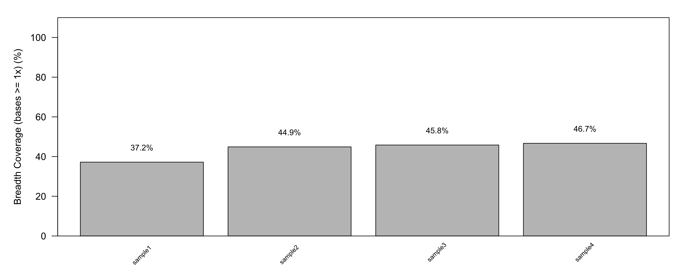

# breadth-coverage-calculator

R script to compute breadth coverage metrics from deepTools plotCoverage tab-delimited output files

Calculates coverage statistics at 1x depth for each sample:
- **Depth mean**: Average coverage depth across the genome
- **Breadth**: Median percentage of bases with ≥1x coverage per chromosome  
- **Bases ≥1x**: Percentage of bases covered at least once

Outputs:
- TSV file with statistics
- PDF barplot of breadth coverage at 1x

## Usage

```bash
Rscript check_breath_coverage.R <input_file.txt>
```

## Input

Tab-delimited file from deepTools [`plotCoverage`](https://deeptools.readthedocs.io/en/develop/content/tools/plotCoverage.html) with `--outRawCounts`:

```bash
plotCoverage -b sample1.bam sample2.bam sample3.bam sample4.bam \
    --outRawCounts coverage.txt
```

## Output

```bash
Rscript check_breath_coverage.R coverage.txt
```

Generates:
- `coverage_stats.tsv`
- `coverage_breadth_coverage.pdf`

Example stats file:
```
Sample      Depth_mean    Breadth    Bases_>=1x
sample1     0.537         37.2       37.2
sample2     0.649         44.9       44.9
sample3     0.605         45.8       45.8
sample4     0.659         46.7       46.7
```

Example plot:


